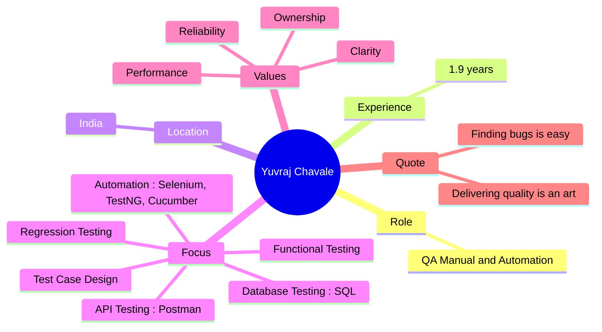
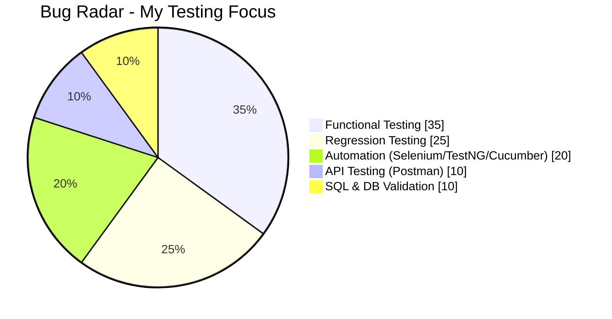
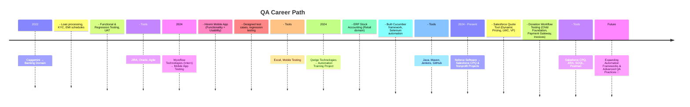
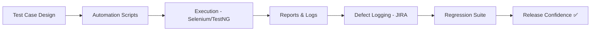

<!-- Banner

  

-->

<!-- Typing Intro -->
<h1 align="center">
  
</h1>

  <em>Not just finding bugs — building confidence in every release.</em>

---

## 🧑‍💻 About Me 

---
---
## 👨‍💻 About Me – *Yuvraj Chavale*

Hey there! I'm **Yuvraj Chavale**, a Quality Analyst with 1.9 years of hands-on experience in manual and automation testing across domains like **Banking**, **Salesforce CPQ**, and **Mobile Applications**. I specialize in crafting robust test cases, executing functional and regression testing, and building automation frameworks that elevate software quality from good to exceptional.

I’ve worked with tools like **Selenium**, **TestNG**, **Cucumber**, **Postman**, and **SQL**, and I’m fluent in Agile methodologies, CI/CD pipelines, and defect lifecycle management using **JIRA**, **GitHub**, and **Jenkins**. Whether it’s validating dynamic pricing logic in Salesforce CPQ or ensuring seamless donation workflows for nonprofits, I bring clarity, precision, and ownership to every test cycle.

> 🧪 “Finding bugs is easy. Delivering quality is an art.”  
> I see testing as a symphony—each bug a discord, each fix a harmony. Quality isn’t noise—it’s the silence after a flawless release.

---

### 🔧 Tech Stack & Tools  
- **Testing Types**: Manual, Functional, Regression, UAT, Sanity  
- **Automation**: Selenium WebDriver, TestNG, Cucumber (BDD), Maven, POM Framework  
- **Languages**: Java (Core), SQL, Gherkin, SOQL  
- **API Testing**: Postman, REST API Validation, USAePay  
- **Test Management**: JIRA, TestRail, Zephyr  
- **CI/CD & Version Control**: Git, GitHub, Jenkins  
- **Platforms**: Salesforce CPQ, Visualforce, LWC, Mobile Apps (Hiremi), ERP Systems  
- **Soft Skills**: Communication, Team Collaboration, Attention to Detail, Client Interaction, Leadership

---

### 🎯 Core Values  
🔍 **Clarity** • 🔒 **Reliability** • ⚡ **Performance** • 🧭 **Ownership**

---

### 📈 Career Highlights  
- Led QA efforts for Salesforce Quote Tool, improving defect catch rate by 30%  
- Validated donation workflows and payment gateway integrations for nonprofit platforms  
- Designed and implemented automation frameworks that reduced test maintenance  
- Supported UAT and achieved 95% client satisfaction in banking domain projects  
- Collaborated with cross-functional teams to enhance test coverage and reduce misalignment delays

---

Let’s engineer confidence—one test at a time.
---

## 🛰️ Bug Radar

---

## 🛠️ Tech Radar

  

---

## ⏳ My QA Journey (Timeline)

---

## 🧪 Test Pipeline

---

## 📊 GitHub Analytics

  
  

  

---

## 📈 Activity Graph

  

---

## 🐍 Snake Animation

  

---

## 🌐 Connect

  
  
  
  

---

<!-- Footer -->

  

